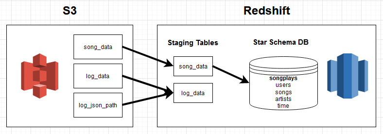
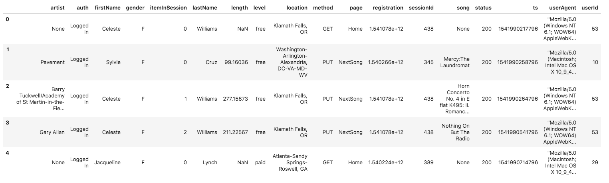
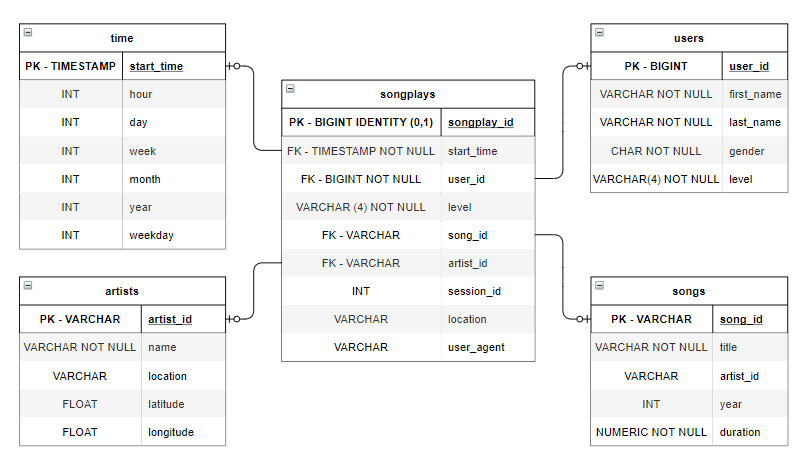

# Project: Sparkify Cloud Data Warehouses 🎧💾

## 📃 Project Summary

This project aims to build a cloud data warehouse solution on AWS for the analytics department of a (fake) streaming music company.

## 🎯 Objectives

Build an ETL pipeline that extracts data from S3, stages them in Redshift, and transforms it into a set of dimensional tables

**Overview of the system architecture:**  



## 📂 Project Datasets

| Name         | S3 URI                               | Region    |
| ------------ | ------------------------------------ | --------- |
| Song data    | s3://udacity-dend/song_data          | us-west-2 |
| Log data     | s3://udacity-dend/log_data           | us-west-2 |
| Log metadata | s3://udacity-dend/log_json_path.json | us-west-2 |

The first dataset is a subset of real data from the Million Song Dataset. Each file is in JSON format and contains metadata about a song and the artist of that song. The files are partitioned by the first three letters of each song's track ID. For example, here are file paths to two files in this dataset.

```
song_data/A/B/C/TRABCEI128F424C983.json
song_data/A/A/B/TRAABJL12903CDCF1A.json
```

And below is an example of what a single song file, TRAABJL12903CDCF1A.json, looks like:
```json
{"num_songs": 1, "artist_id": "ARJIE2Y1187B994AB7", "artist_latitude": null, "artist_longitude": null, "artist_location": "", "artist_name": "Line Renaud", "song_id": "SOUPIRU12A6D4FA1E1", "title": "Der Kleine Dompfaff", "duration": 152.92036, "year": 0}
```

The second dataset consists of log files in JSON format generated by an event simulator based on the songs in the dataset above. These simulate app activity logs from an imaginary music streaming app based on configuration settings.

The log files in the dataset are partitioned by year and month. For example, here are file paths to two files in this dataset.
```
log_data/2018/11/2018-11-12-events.json
log_data/2018/11/2018-11-13-events.json
```
And below is an example of what the data in a log file, 2018-11-12-events.json, looks like:


The log_json_path.json file is used when loading JSON data into Redshift. It specifies the structure of the JSON data so that Redshift can properly parse and load it into the staging tables. It is needed for staging the **log data** into Redshift.

## 🔧 Database schema design and ETL pipeline
Designed as a **star schema** database, optimized for queries on song play analysis.
The tables are as follows : 
- **Fact Table**
    - `songplays` : records in log data associated with song plays i.e. records with page NextSong  
- **Dimension Table**
    - `users` : users in the app
    - `songs` : songs in music database
    - `artists` : artists in music database
    - `time` : timestamps of records in songplays broken down into specific units

The Entity Relation Diagram: 
 


## 🎨 Setup

Create a local Python environment using conda:
```shell
conda create --name sparkify python=3.12
```
Activate the environment:
```shell
conda activate sparkify
```

Install all the Python packages:
```shell
pip install -r requirements.txt
```

Rename **dwh.cfg.template** to **dwh.cfg**. In **dwh.cfg**, include your *AWS access key*, *secret access key*, and the *AWS region*. Additionally, provide values for *db_name*, *db_user*, *db_password* and *db_port* fields, leaving the host field blank.

Create an IAM role, security group and redshift cluster:
```shell
python redshift_iac.py init
```

Wait for your Redshift cluster to become available:
```shell
python redshift_iac.py status
```
You can now start using your Redshift cluster!

## 🚀 Usage

Create the tables: 
```shell
python create_tables.py
```

Run the ETL pipeline:
```shell
python etl.py
```

You can check the data was correctly inserted by using the query editor on Amazon Redshift.

Don't forget to pause or delete the Redshift cluster once done!
```shell
python redshift_iac.py delete
```

## 🛠️ Technologies and Tools

- **Cloud**: AWS
- **Data Warehouse**: AWS Redshift
- **Infrastructure As Code**: Boto3
- **Data Storage**: AWS S3
- **Batch processing**: Spark (PySpark)
- **Language**: Python